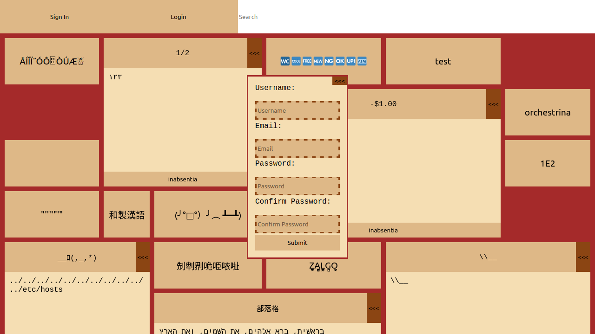
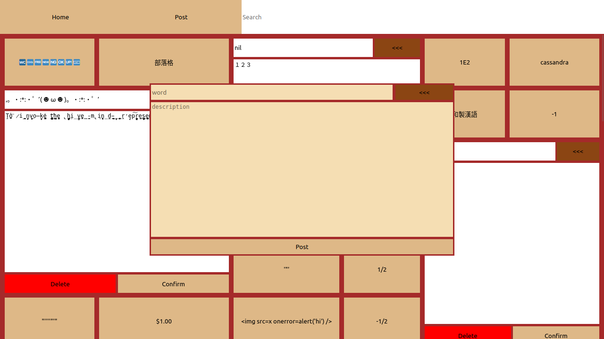

# Neolexicon

## Description
Neolexicon is a (Postgres, Express, React, Node.js) PERN Stack web project that is designed for creating and searching made up words by users in the website.

## Website Preview

